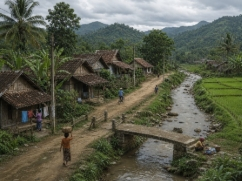
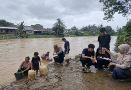

# **SOAL ESAI CPSS**
Tabel 1. Penurunan 7 Indikator *Creative Problem Solving* Skills (CPSS) ke dalam Indikator Soal

|**INDIKATOR CPSS**|**SOAL**|**JAWABAN**|
| :-: | :-: | :-: |
|
**Indikator:** *Fluency*

**Sub-Indikator:**

Menghasilkan banyak gagasan aplikasi relevan dalam waktu terbatas terhadap stimulus terbuka (Torrance, 1974; Guilford, 1967; Runco & Acar, 2012)

**Indikator Soal:**

Disajikan wacana tentang air sungai yang keruh di sebuah desa. Peserta didik mampu mengemukakan ≥5 gagasan solusi untuk menjernihkan air sungai yang dapat diterapkan oleh masyarakat desa dengan menggunakan alat dan bahan yang mudah diperoleh.

**Ranah Kognitif:** 

C3 Mengaplikasi
|
**Wacana Stimulus**

Desa Mekarsari terletak di tepi Sungai Cibanten. Selama musim hujan, air sungai yang menjadi sumber utama kebutuhan warga berubah menjadi sangat keruh, berwarna kecokelatan. Hasil pengamatan sederhana yang dilakukan kelompok karang taruna menunjukkan kondisi air sebagai berikut:
||

|**Parameter**|**Hasil Pengamatan**|**Standar PERMENKES 492/2010**|
| - | - | - |
|Warna|Kecoklatan|Tidak berwarna|
|Kekeruhan|Sangat keruh|Maks. 25 NTU|
|Bau|Sedikit berbau lumpur|Tidak berbau|
|pH|6,5|6,5 – 8,5|

||

Air keruh tersebut membuat warga kesulitan memperoleh air bersih untuk diminum, dimasak, dan dicuci. Pak Rahmat, seorang dosen fisika, memperkenalkan alat elektrokoagulasi kepada warga. Alat ini bekerja dengan cara mengalirkan arus listrik searah (DC) dari aki atau adaptor melalui dua lempeng logam (elektroda), biasanya aluminium atau besi, yang dicelupkan ke dalam air keruh. Arus listrik membuat elektroda melepaskan ion logam yang kemudian mengikat partikel kotoran sehingga menggumpal (flok) dan mengendap di dasar wadah. Air di bagian atas menjadi lebih jernih dan dapat digunakan setelah penyaringan akhir.

**SOAL 1**

**Pertanyaan:** Berdasarkan wacana di atas, kemukakan minimal 5 gagasan solusi sederhana untuk menjernihkan air sungai yang keruh di Desa Mekarsari selain menggunakan alat elektrokoagulasi. Gagasan harus dapat diterapkan oleh warga desa dengan menggunakan alat dan bahan yang mudah diperoleh di sekitar mereka.
|
- Menyaring air menggunakan saringan berlapis pasir, kerikil, ijuk, dan arang aktif.

- Mengendapkan air dalam wadah besar selama beberapa jam agar kotoran turun ke dasar wadah.

- Menambahkan tawas (aluminium sulfat) untuk mempercepat penggumpalan kotoran.

- Merebus air hingga mendidih untuk membunuh mikroba sebelum digunakan.

- Menjemur air dalam botol plastik bening di bawah sinar matahari (metode SODIS).

- Menyaring air menggunakan kain katun bersih berlapis sebagai penyaring awal.

- Memanfaatkan biji kelor (*Moringa oleifera*) yang dihaluskan sebagai koagulan alami.

*Catatan penilaian: Jawaban dianggap benar bila relevan, berbeda satu sama lain, dan realistis untuk diterapkan oleh warga desa.*

|
| - | :-: | - |
|
**Indikator:** 

*Flexibility*

**Sub-Indikator:**

Menghasilkan banyak gagasan dari beragam kategori/ perspektif konseptual

*(Torrance, 1974; Kim, 2006; Runco & Acar, 2012)*

**Indikator Soal:** 

Disajikan wacana yang sama, peserta didik mampu menganalisis pemanfaatan alat penjernihan air sederhana untuk mengatasi keruhnya air sungai dari ≥4 perspektif/kategori berbeda (misalnya: fisika, kimia, biologi, teknologi sederhana, sosial-ekonomi, atau kebijakan/lingkungan)

**Ranah Kognitif:** 

C4 Menganalisis
|
**SOAL 2**

**Pertanyaan:** Berdasarkan wacana soal 1, analisislah pemanfaatan alat elektrokoagulasi sederhana untuk mengatasi keruhnya air sungai dari minimal 4 perspektif yang berbeda. Pilih dari sudut pandang berikut: fisika, kimia, biologi, teknologi sederhana, sosial-ekonomi, atau kebijakan/lingkungan.
|
- Perspektif Kimia: Arus listrik menyebabkan elektroda aluminium teroksidasi, melepaskan ion Al³⁺ yang bereaksi dengan air membentuk Al(OH)₃, yaitu senyawa pengikat partikel kotoran sehingga menggumpal menjadi flok.

- Perspektif Fisika: Proses elektrokoagulasi memanfaatkan prinsip aliran arus listrik searah (DC) untuk memindahkan muatan listrik, sehingga partikel koloid yang semula stabil kehilangan kestabilannya dan saling menarik membentuk endapan.

- Perspektif Biologi: Pengendapan partikel sekaligus mengurangi jumlah mikroorganisme patogen yang menempel pada partikel kotoran, sehingga air menjadi lebih aman digunakan.

- Perspektif Teknologi Sederhana: Alat ini dirancang dari komponen sederhana seperti aki bekas, kabel, dan lempeng logam sehingga mudah dibuat dan dirakit ulang oleh warga desa tanpa keahlian khusus.

- Perspektif Sosial-Ekonomi: Penerapan alat ini membantu warga memperoleh air bersih dengan biaya rendah, sekaligus mengurangi ketergantungan pada air kemasan yang mahal.

- Perspektif Kebijakan/Lingkungan: Penggunaan elektrokoagulasi mendukung program pemerintah dalam penyediaan air bersih sesuai PERMENKES 492/2010, serta ramah lingkungan karena tidak menghasilkan limbah kimia berbahaya seperti pada penggunaan tawas berlebihan.

*Catatan penilaian: Cukup. 4 perspektif berbeda dijelaskan secara logis dan relevan.*

|
|
**Indikator:** 

*Originality*

**Sub-Indikator:** 

Menghasilkan ide unik, jarang muncul, dan inovatif di luar pola konvensional 

*(Torrance, 1974; Kaufman & Beghetto, 2009; Hu & Adey, 2002)*

**Indikator Soal:**

Disajikan wacana, peserta didik mampu merancang satu modifikasi inovatif pada alat elektrokoagulasi (pada bagian elektroda, sumber energi, bentuk reaktor, atau penambahan tahapan) yang berbeda dari rancangan umum, disertai alasan ilmiah sederhana mengapa modifikasi tersebut dianggap baru/lebih baik

**Ranah Kognitif:**

C6 Mencipta
|
**SOAL 3**

**Pertanyaan:** Berdasarkan wacana pada soal 1, rancanglah satu modifikasi inovatif pada alat elektrokoagulasi milik Pak Rahmat. Modifikasi dapat dilakukan pada bagian elektroda, sumber energi, bentuk reaktor, atau penambahan tahapan. Sertakan alasan ilmiah sederhana mengapa modifikasi yang kamu rancang dianggap baru atau lebih baik daripada rancangan umum.
|
- Modifikasi sumber energi dengan panel surya mini: Mengganti aki dengan panel surya kecil agar alat dapat dioperasikan tanpa biaya listrik, terutama saat musim hujan dengan intensitas cahaya yang masih cukup. Alasan: hemat energi, ramah lingkungan, dan cocok untuk daerah pedesaan.

- Modifikasi elektroda dengan kombinasi aluminium-besi bergantian: Menggunakan dua jenis logam yang dipasang secara berselang-seling untuk meningkatkan jumlah ion koagulan dalam air. Alasan: kombinasi Al³⁺ dan Fe²⁺ menghasilkan flok yang lebih cepat mengendap.

- Modifikasi reaktor bertingkat (multi-stage): Membuat tiga wadah yang terhubung secara bertingkat sehingga air mengalir secara otomatis dari proses elektrokoagulasi, pengendapan, hingga penyaringan akhir. Alasan: lebih praktis dan dapat menghasilkan air bersih dalam jumlah lebih besar serta secara kontinu.

- Penambahan tahapan pra-saringan dengan biji kelor: Menambahkan koagulan alami dari biji kelor sebelum proses elektrokoagulasi agar pemakaian listrik lebih hemat. Alasan: biji kelor mempercepat penggumpalan awal sehingga proses elektrokoagulasi menjadi lebih cepat.

*Catatan penilaian: Modifikasi dianggap orisinal jika berbeda dari deskripsi pada wacana, dengan justifikasi ilmiah yang logis. Cukup satu modifikasi.*

|
|
**Indikator:** 

*Elaboration*

**Sub-Indikator:** 

Mengembangkan gagasan secara rinci, terstruktur, dan terperinci 

*(Torrance, 1974; Kim, 2006)*

**Indikator Soal:** 

Disajikan wacana prosedur yang salah, peserta didik mampu mengevaluasi kelengkapan prosedur dengan menyusun rincian tahapan kerja yang sistematis, meliputi alat-bahan, langkah pengoperasian, parameter penting (waktu, tegangan, jenis elektroda), serta antisipasi kesalahan yang mungkin terjadi

**Ranah Kognitif:** 

C5 Mengevaluasi
|
**SOAL 4**

Setelah memperkenalkan alat elektrokoagulasi sederhana kepada warga, Pak Rahmat meminta salah satu mahasiswa Pendidikan Fisika, Andi, untuk menyusun prosedur penggunaan alat tersebut. Berikut adalah prosedur yang dibuat oleh Andi:

*Prosedur Penggunaan Alat Elektrokoagulasi (Versi Andi):*

1. Siapkan ember berisi air sungai yang keruh.

2. Masukkan dua lempeng logam ke dalam ember hingga saling menempel agar arus listrik mengalir lebih kuat.

3. Sambungkan kabel ke aki tanpa memperhatikan kutub positif dan negatif.

4. Nyalakan arus listrik dan biarkan selama 2 jam agar air benar-benar jernih.

5. Setelah selesai, langsung minum air hasil olahan tanpa proses tambahan.

Pak Rahmat menilai prosedur Andi masih memiliki banyak kekurangan dan kesalahan, sehingga perlu dievaluasi dan disusun ulang agar aman serta efektif digunakan oleh warga Desa Mekarsari.

**Pertanyaan:** 

Berdasarkan wacana di atas, evaluasilah prosedur penggunaan alat elektrokoagulasi yang disusun oleh Andi. Susun kembali prosedur yang lengkap, sistematis, dan benar yang mencakup 4 komponen: (1) alat dan bahan yang dibutuhkan; (2) langkah pengoperasian yang benar; (3) parameter penting seperti waktu, tegangan, dan jenis elektroda; serta (4) antisipasi kesalahan.
|

**Kesalahan pada prosedur Andi:**

- Lempeng logam saling menempel → berisiko korsleting.

- Kutub aki (+/–) tidak diperhatikan → proses elektrokoagulasi tidak berjalan dengan baik.

- Durasi 2 jam terlalu lama → air panas berlebihan, elektroda cepat habis (seharusnya 15–20 menit).

- Air langsung diminum tanpa pengendapan, penyaringan, dan perebusan → berisiko bagi kesehatan.

**Prosedur yang benar:**

**a. Alat dan bahan:** Wadah 5 liter; dua lempeng aluminium 10×5 cm; aki/adaptor DC 12 volt; kabel dan penjepit buaya; saringan (kain atau pasir-kerikil-arang aktif); gelas ukur dan stopwatch; air sungai keruh.

**b. Langkah pengoperasian:**

- Isi wadah dengan ±4 liter air keruh.

- Pasang dua lempeng aluminium sejajar, berjarak ±3 cm (tidak bersentuhan).

- Sambungkan tiap lempeng ke kutub positif dan negatif aki.

- Alirkan arus selama 15–20 menit sambil mengamati flok yang terbentuk.

- Matikan arus, lalu diamkan selama 20–30 menit hingga flok mengendap.

- Pindahkan air jernih ke wadah lain, lalu saring.

- Rebus air sebelum dikonsumsi.

**c. Parameter penting:** Tegangan 12 V DC; waktu 15–20 menit; jarak elektroda ±3 cm; elektroda aluminium/besi; pH air 6,5–8,5 agar flok terbentuk secara optimal.

**d. Antisipasi kesalahan:** Elektroda tidak boleh bersentuhan (cegah korslet); tangan tidak masuk ke air saat alat menyala (cegah sengatan listrik); arus tidak dialirkan terlalu lama (cegah panas berlebih & elektroda cepat menipis); ganti elektroda yang sudah menipis; air tetap direbus sebelum diminum karena alat belum menghilangkan mikroba sepenuhnya.

*Catatan penilaian: Peserta didik dianggap mampu mengevaluasi dengan baik bila dapat mengidentifikasi minimal 3 kesalahan pada prosedur Andi, serta menyusun prosedur yang benar dengan keempat komponen (a–d) yang terjabarkan secara rinci dan sistematis.*

|
|
**Indikator:**

*Problem Identification*

**Sub-Indikator:**

Mengenali, menguraikan, dan memetakan akar masalah secara sistematis berbasis data empiris (Treffinger et al., 2000; OECD, 2014)

**Indikator Soal:** 

Disajikan wacana permasalahan air sungai keruh di Desa Mekarsari beserta data parameter kualitas air, peserta didik mampu menguraikan dan memetakan akar masalah secara sistematis dengan mengidentifikasi minimal 3 parameter kualitas air yang menyimpang dari standar, menelusuri faktor penyebab penyimpangan berdasarkan data empiris, serta merumuskan inti permasalahan yang dihadapi warga desa.

**Ranah Kognitif:**

C4 Menganalisis
|
**SOAL 5**

**Krisis Air Bersih di Desa Mekarsari**

Desa Mekarsari di tepi Sungai Cibanten, Kabupaten Serang, Provinsi Banten, menggantungkan kebutuhan air sehari-hari warganya pada aliran sungai tersebut. Namun, selama musim hujan, kondisi air berubah drastis menjadi kecoklatan, sangat keruh, dan berbau tanah. Sebagai bagian dari program pengabdian masyarakat sekolah, kelompok karang taruna bersama Bu Nurtati, dosen fisika, melakukan pengamatan kualitas air Sungai Cibanten selama tiga hari berturut-turut pada minggu pertama musim hujan dengan mengambil sampel di tiga titik berbeda (hulu, tengah, dan hilir desa), dan hasil rata-ratanya dirangkum pada tabel berikut:
||

|**Parameter**|**Hasil Pengamatan**|**Standar PERMENKES 32/2017**|
| :-: | :-: | :-: |
|Warna|Kecoklatan (±80 TCU)|Maksimum 50 TCU|
|Kekeruhan|Sangat keruh (±120 NTU)|Maksimum 25 NTU|
|Bau|Berbau tanah|Tidak berbau|
|pH|6,5|6,5 – 8,5|

||

**Pertanyaan:**

- Identifikasi minimal 3 parameter kualitas air yang menyimpang dari standar.

&emsp;- Telusuri faktor penyebab terjadinya penyimpangan pada masing-masing parameter tersebut.

|
**a. Identifikasi parameter yang menyimpang dari standar PERMENKES 492/2010:**

1. Parameter warna: Air sungai berwarna kecoklatan, sedangkan standar mensyaratkan air bersih tidak berwarna.

2. Parameter kekeruhan: Air dalam kondisi sangat keruh, melebihi batas maksimum 25 NTU yang ditetapkan.

3. Parameter bau: Air berbau lumpur, sedangkan standar mensyaratkan air bersih dan tidak berbau.

*(Parameter pH masih memenuhi standar, yaitu 6,5, sehingga tidak termasuk parameter yang menyimpang.)*

**b. Faktor penyebab penyimpangan berbasis data empiris:**

1. Penyebab warna kecoklatan: Air membawa partikel tanah, lumpur, dan bahan organik terlarut akibat erosi tanah di sepanjang aliran sungai, terutama saat musim hujan ketika aliran air membawa material dari daerah hulu.

2. Penyebab kekeruhan tinggi: Tingginya konsentrasi partikel tersuspensi (lumpur, pasir halus, sisa daun) yang terbawa oleh aliran sungai saat curah hujan tinggi; kemungkinan juga disebabkan oleh aktivitas pembukaan lahan di sekitar daerah aliran sungai (DAS).

3. Penyebab bau tanah: Tercampurnya bahan organik dari sedimen dasar sungai yang teraduk oleh derasnya arus saat musim hujan, serta proses penguraian materi organik oleh mikroorganisme di dalam air.

*Catatan penilaian: Peserta didik dianggap mampu mengidentifikasi akar masalah dengan baik apabila dapat menyebutkan minimal 3 parameter yang menyimpang (a) serta menelusuri faktor penyebab secara logis berdasarkan data wacana (b).*
|
| - | - | - |
|
**Indikator:** 

*Solution Planning*

**Sub-Indikator:** 

Merencanakan solusi sistematis dengan menganalisis kelayakan membran rancangan secara mekanik menggunakan data uji tarik

*(Treffinger et al., 2000; Isaksen & Treffinger, 2004; Polya, 1945)*

**Indikator Soal:** 

Disajikan data hasil uji coba alat elektrokoagulasi sederhana dengan variasi tegangan listrik dan jenis elektroda terhadap kualitas air sungai yang keruh. Peserta didik mampu mengevaluasi kelayakan operasional alat dengan menganalisis nilai penurunan kekeruhan dan efisiensi waktu, membandingkannya dengan standar acuan, serta merencanakan solusi berupa pemilihan kombinasi parameter alat yang paling tepat untuk diterapkan secara sistematis di Desa Mekarsari.

**No. Soal:** 6

**Ranah Kognitif:**

C5 Mengevaluasi
|
**SOAL 6**

Bu Rima bersama mahasiswa Pendidikan Fisika melakukan uji coba laboratorium untuk menentukan kombinasi parameter alat elektrokoagulasi yang paling efektif. Tim melakukan tiga variasi pengujian (E1, E2, E3) dengan perbedaan jenis elektroda dan tegangan listrik, lalu mengukur penurunan kekeruhan air serta waktu pengoperasian yang diperlukan. Sampel air berasal dari Sungai Cibanten dengan kekeruhan awal ±120 NTU. Hasil uji coba disajikan pada tabel berikut:
||

|Variasi Alat|Jenis Elektroda|Tegangan (Volt DC)|Arus (A)|Kekeruhan Akhir (NTU)|Waktu Operasi (menit)|
| - | - | - | - | - | - |
|E1|Besi (Fe)|9|1,5|38|25|
|E2|Aluminium (Al)|12|2,5|18|20|
|E3|Aluminium (Al)|24|4,0|12|15|

||

Standar acuan minimum untuk penerapan alat di Desa Mekarsari:

- Kekeruhan akhir maksimum: 25 NTU (sesuai PERMENKES 32/2017 untuk air keperluan higiene sanitasi)

- Waktu pengoperasian maksimum: 20 menit (agar efisien untuk operasional harian warga)

- Tegangan listrik maksimum: 12 Volt DC (agar aman dioperasikan warga dengan sumber aki sederhana)

**Pertanyaan**

a. Evaluasilah masing-masing variasi alat (E1, E2, E3) berdasarkan kekeruhan akhir, waktu operasi, dan tegangan listrik terhadap standar acuan.

b. Rencanakan langkah-langkah sistematis untuk pemilihan dan penerapan variasi alat terpilih di Desa Mekarsari (minimal 4 langkah terurut).

c. Berdasarkan konsep energi listrik W=V×I×tHitunglah energi listrik (dalam joule dan kWh) yang digunakan oleh masing-masing variasi alat (E1, E2, E3) dalam satu kali proses pengolahan air.

|
**a. Evaluasi kelayakan operasional tiap variasi alat:**

- E1: Kekeruhan (38 NTU) dan waktu (25 menit) melampaui standar; tegangan (9 V) aman, tetapi hasilnya kurang efektif → tidak layak.

- E2: Kekeruhan (18 NTU), waktu (20 menit), dan tegangan (12 V) semuanya memenuhi standar → layak diterapkan.

- E3: Kekeruhan (12 NTU) dan waktu (15 menit) unggul, tetapi tegangan (24 V) melampaui batas aman → berisiko bagi keselamatan warga → tidak layak dari segi keamanan.

**b. Rencana sistematis penerapan variasi alat terpilih:**

- Pengadaan: Tetapkan E2 sebagai desain final; siapkan elektroda aluminium 10×5 cm, aki/adaptor 12 V, kabel, dan wadah 5 liter untuk 2 unit alat.

- Uji ulang skala kecil: Uji E2 dengan sampel air Cibanten di lab sekolah untuk memastikan hasil dapat diulang.

- Penerapan prosedur: Operasikan selama 20 menit pada 12 V, endapkan flok selama 20–30 menit, saring dengan kain/pasir-arang aktif, dan rebus jika untuk air minum.

- Sosialisasi & pelatihan: Demonstrasikan alat, latih perwakilan RT, buat panduan singkat dengan parameter kunci (12 V, 20 menit).

- Pemantauan & pemeliharaan: Cek elektroda setiap 1–2 minggu, pantau kualitas air, dan siapkan suku cadang.

**c. Perhitungan energi listrik**

Variasi E1:

W1=V×I×t=9 V×1,5 A×(25×60 s)=9×1,5×1500=20.250 J=20,25 kJ,W1=9×1,5×2560 jam=5,625 Wh=0,005625 kWh

Variasi E2:

W2=12×2,5×(20×60)=12×2,5×1200=36.000 J=36 kJ W2=12×2,5×2060=10 Wh=0,01 kWh

Variasi E3:

W3=24×4,0×(15×60)=24×4×900=86.400 J=86,4 kJ W3=24×4×1560=24 Wh=0,024 kWh

*Catatan penilaian: Peserta didik dianggap mampu merencanakan solusi sistematis bila dapat mengevaluasi ketiga variasi alat berbasis data empiris (a) serta menyusun minimal 4 langkah penerapan yang logis, terurut, dan kontekstual dengan kondisi Desa Mekarsari (b).*

|
| - | - | - |
|
**Indikator:**

*Solution Implementation*

Dalam konteks Sains dan Match

**Sub-Indikator:** 

Merancang inovasi ciptaan dari implementasi solusi terintegrasi berbasis bukti ilmiah disertai antisipasi kendala lapangan 

*(Treffinger et al., 2000; OECD, 2014; Isaksen & Treffinger, 2004)*

**Indikator Soal:** 

**No. Soal:** 7

**Ranah Kognitif:** 

C6 Mencipta
|
**SOAL 7**

Setelah variasi alat E2 (elektroda aluminium, 12 volt DC, waktu operasi 20 menit) terbukti paling layak di laboratorium, Pak Rahmat menantang mahasiswa Pendidikan Fisika untuk merancang sistem implementasi yang utuh dan inovatif di Desa Mekarsari. Pak Rahmat mengingatkan bahwa keberhasilan solusi tidak hanya ditentukan oleh kinerja alat di laboratorium, melainkan juga oleh kesiapan dalam menghadapi kendala di lapangan, seperti keterbatasan listrik, kondisi musim, kebiasaan warga, serta keberlanjutan operasi alat dalam jangka panjang. Beberapa fakta tambahan yang perlu dipertimbangkan mahasiswa:

- Aliran listrik PLN di Desa Mekarsari sering padam saat musim hujan.

- Warga belum terbiasa mengoperasikan alat berbasis listrik secara mandiri.

- Volume kebutuhan air bersih warga rata-rata mencapai 200 liter per keluarga per hari.

- Tidak semua warga bersedia mengonsumsi air hasil olahan tanpa proses pendukung tambahan.

- Elektroda aluminium mengalami penipisan setelah ±30 kali pengoperasian.

**Pertanyaan**

a. Rancanglah inovasi sistem alat penjernihan air elektrokoagulasi yang mencakup gambaran umum, komponen, dan alur kerja terintegrasi untuk mengatasi kendala lapangan yang diprediksi akan muncul.

b. Jika sumber listrik cadangan berasal dari aki 12 volt berkapasitas 40 Ah yang diisi ulang melalui panel surya.

&emsp;Hitunglah energi listrik (dalam Wh) yang dibutuhkan reaktor di Desa Mekarsari untuk satu siklus operasi. Tentukan berapa kali siklus operasi yang dapat dilakukan aki tersebut dalam satu kali pengisian penuh (asumsikan seluruh kapasitas aki dapat digunakan).
|
**a. Rancangan inovasi sistem "Unit Elektrokoagulasi Terpadu Mekarsari (UET-M)":**

Sistem dirancang berupa unit pengolahan air tiga tahap terintegrasi yang dapat dioperasikan secara bergantian oleh kelompok warga:

- Tahap 1 Pra-pengendapan: Air sungai ditampung dalam bak pengendap berkapasitas 100 liter dan dibiarkan selama 1 jam agar partikel besar mengendap secara alami sebelum masuk ke reaktor utama.

- Tahap 2 Reaktor Elektrokoagulasi: Air dialirkan ke reaktor berkapasitas 5 liter yang berisi sepasang elektroda aluminium berukuran 10 × 5 cm dan dioperasikan pada tegangan 12 volt DC selama 20 menit (sesuai hasil uji coba E2). Sumber listrik utama berasal dari aki 12 V yang diisi ulang melalui panel surya mini sebagai cadangan saat PLN padam.

- Tahap 3 Penyaringan dan Disinfeksi Akhir: Air hasil elektrokoagulasi disaring melalui susunan pasir-kerikil-arang aktif, kemudian dimasukkan ke wadah penyimpanan dengan opsi perebusan atau disinfeksi sinar matahari (SODIS) sebelum dikonsumsi.

Unit dirancang modular sehingga jumlah reaktor dapat ditambah sesuai dengan kebutuhan harian warga.

**b. Energi per siklus:**

W=V×I×t

Waktu operasi 20 menit = 20/60 jam ≈ 0,333 jam

W=12 V×2,5 A×0,333 jam=10 Wh

Kapasitas total aki:

Waki=V×C=12 V×40 Ah=480 Wh

Jumlah siklus yang dapat dilakukan:

n=WakiWsiklus=480 Wh10 Wh=48 siklus

Kesimpulan: Satu kali pengisian penuh aki 12 V/40 Ah mampu menjalankan reaktor di Desa Mekarsari sebanyak 48 kali siklus operasi, sehingga cukup untuk kebutuhan operasional harian warga sebelum aki perlu diisi ulang kembali melalui panel surya. Iinformasi ini menjadi dasar teknis untuk menentukan jadwal pengisian ulang aki dalam SOP pemeliharaan

*Catatan penilaian: Peserta didik dianggap mampu merancang inovasi implementasi solusi dengan baik bila dapat menyusun rancangan sistem yang terintegrasi dan inovatif.*
|

