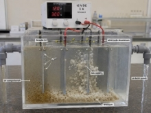
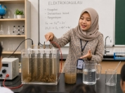

# **SOAL ESAI PCK**
Tabel 1. Penurunan 5 Indikator *Pedagogical Content Knowledge* (PCK) ke dalam Indikator Soal

|**Indikator CPSS**|**Soal**|**Jawaban**|
| :-: | :-: | :-: |
|
**Indikator:** 

*Content Knowledge*

**Sub-Indikator:**

Pemahaman konsep fisika proses elektrokoagulasi (hukum Faraday, medan listrik, gaya Lorentz, transfer muatan)

**Indikator Soal:**

Disajikan wacana, peserta didik mampu menjelaskan mekanisme fisika yang mendasari proses elektrokoagulasi dalam pemurnian air.

**Ranah Kognitif:**

C2 (Memahami)
|
**SOAL 1**

Sebuah unit elektrokoagulasi dioperasikan menggunakan elektroda aluminium dengan tegangan DC sebesar 12 V dan arus listrik sebesar 3 A selama 30 menit. Air sungai yang mengandung partikel koloid tersuspensi dialirkan melalui reaktor tersebut. Setelah proses berlangsung, terlihat flok-flok putih terbentuk dan mengendap di dasar reaktor, sehingga air yang keluar tampak lebih jernih.

**Pertanyaan:** 

Jelaskan mekanisme fisika yang mendasari terbentuknya flok-flok aluminium tersebut! Kaitkan dengan konsep transfer muatan listrik dan Hukum Faraday dalam konteks pemurnian air melalui elektrokoagulasi.
|Ketika arus listrik DC dialirkan melalui elektroda aluminium, terjadi oksidasi pada anoda yang menghasilkan ion Al³⁺ (Al → Al³⁺ + 3e⁻). Berdasarkan Hukum Faraday I, massa ion yang dihasilkan berbanding lurus dengan muatan listrik (Q = I × t), sehingga dalam 30 menit dengan arus 3 A dihasilkan muatan sebesar 5.400 C. Ion Al³⁺ yang terlarut bereaksi dengan molekul air membentuk Al(OH)₃ (flok). Flok-flok ini berfungsi sebagai koagulan yang menjebak partikel koloid melalui mekanisme adsorpsi dan netralisasi muatan, sehingga partikel bergabung (aglomerasi) dan mengendap karena gaya gravitasi melebihi gaya tolak-menolak elektrostatik antarpartikel koloid.|
|
**Indikator:** 

*Curriculum Knowledge*

**Sub-Indikator:**

Keterkaitan topik elektrokoagulasi dengan capaian pembelajaran Kurikulum Merdeka pada mata pelajaran Fisika

**Indikator Soal:** 

Disajikan wacana, Mahasiswa mampu mengidentifikasi dan mengaitkan topik pemurnian air dan elektrokoagulasi dengan Capaian Pembelajaran (CP) yang relevan dalam kurikulum Fisika SMA

**Ranah Kognitif:** 

C4 Menganalisis
|
**SOAL 2**

Seorang guru fisika ingin menyusun Rencana Pelaksanaan Pembelajaran (RPP)/modul ajar yang mengintegrasikan topik elektrokoagulasi sebagai konteks pembelajaran fisika berbasis isu lingkungan. Guru tersebut mempertimbangkan letak topik ini dalam struktur kurikulum. Selain itu, guru perlu memastikan kesesuaian topik dengan Capaian Pembelajaran yang telah ditetapkan. 

**Pertanyaan:** 

Analisis di mana topik elektrokoagulasi paling tepat diposisikan dalam materi pembelajaran Fisika! Berikan alasan berdasarkan keterkaitan konsep fisika yang terlibat serta tujuan pembelajaran yang ingin dicapai siswa.
|
Topik elektrokoagulasi paling tepat diposisikan pada materi Listrik Dinamis kelas XII, dengan empat perspektif berikut: (1) Secara konten, elektrokoagulasi memanfaatkan konsep arus listrik, hambatan, dan daya listrik yang merupakan inti dari Capaian Pembelajaran Listrik Dinamis, sehingga topik ini menjadi konteks aplikatif yang memperkuat pemahaman konsep tersebut, bukan sekadar materi tambahan; (2) Topik ini mendukung CP terkait penerapan konsep kelistrikan dalam menyelesaikan permasalahan nyata di lingkungan sekitar, sejalan dengan tuntutan pembelajaran kontekstual pada Kurikulum Merdeka; (3) Sebagai proyek P5 (Projek Penguatan Profil Pelajar Pancasila) bertema gaya hidup berkelanjutan, elektrokoagulasi dapat menjadi wahana siswa mempraktikkan konsep fisika sekaligus mengembangkan kesadaran lingkungan; (4) Penempatan pada akhir semester materi Listrik Dinamis lebih tepat karena siswa sudah memiliki fondasi konsep arus, tegangan, dan hambatan yang menjadi prasyarat memahami proses elektrolisis dalam elektrokoagulasi. Sebagai alternatif integratif, topik ini juga dapat dikaitkan dengan isu Sustainable Development Goals (SDGs) tujuan ke-6 (air bersih dan sanitasi layak) untuk memperkuat dimensi kesadaran lingkungan siswa.

*Catatan penilaian: Cukup. 4 perspektif berbeda dijelaskan secara logis dan relevan.*
|
|
**Indikator:** 

*Knowledge of Instructional Strategies*

**Sub-Indikator:** 

*Pemilihan dan penerapan model/metode pembelajaran yang sesuai untuk mengajarkan konsep elektrokoagulasi kepada siswa SMA*

**Indikator Soal:** 

Disajikan wacana, Mahasiswa mampu merancang strategi pembelajaran yang tepat untuk mengajarkan prinsip elektrokoagulasi kepada siswa SMA berdasarkan karakteristik materi

**Ranah Kognitif:** C6 Mencipta
|
**SOAL 3**

Zahra adalah seorang mahasiswa Pendidikan Fisika yang sedang melaksanakan PPL di SMA. Zahra diminta untuk mengajarkan aplikasi listrik arus searah (DC) dalam kehidupan nyata kepada siswa kelas XII. Anda memutuskan untuk menggunakan konteks pemurnian air melalui elektrokoagulasi sederhana. Sekolah memiliki fasilitas laboratorium yang terbatas: tersedia baterai 9 V, kawat tembaga, kabel, dan gelas beker. Air dari sumur sekolah tampak keruh setelah hujan deras.  Pertanyaan: Rancang satu skenario pembelajaran selama 2 × 45 menit menggunakan model pembelajaran berbasis inkuiri untuk topik ini!

**Pertanyaan:** 

Berdasarkan wacana di atas, rancanglah model/metode pembelajaran serta kaitkan fenomena yang diamati dengan konsep fisika DC yang dipelajari siswa.
|Skenario Pembelajaran Inkuiri (2 × 45 menit): (1) Orientasi (10 menit): Guru menampilkan foto sungai keruh dan air jernih setelah diolah, memunculkan pertanyaan "Bagaimana listrik bisa menjernihkan air?"; (2) Rumusan Masalah (10 menit): Siswa berdiskusi dan merumuskan pertanyaan ilmiah, misal "Apakah besar arus listrik memengaruhi kejernihan air?"; (3) Hipotesis (10 menit): Siswa membuat hipotesis berdasarkan pengetahuan hukum Ohm dan arus listrik; (4) Eksperimen (35 menit): Siswa merangkai sel elektrokoagulasi sederhana (kawat tembaga sebagai elektroda, baterai 9V, air keruh dalam gelas beker), mencatat perubahan kekeruhan tiap 5 menit; (5) Analisis (15 menit): Siswa menghubungkan hasil percobaan dengan konsep arus, tegangan, dan hukum Faraday; (6) Kesimpulan & Diskusi (10 menit): Guru membimbing siswa menyimpulkan dan mengaitkan dengan aplikasi nyata IPAL/pengolahan air. Peran guru: fasilitator dan pemberi scaffolding konseptual. Peran siswa: aktif merumuskan, mengamati, dan menganalisis.|
|
**Indikator:** 

*Knowledge of Student Understanding*

**Sub-Indikator:** 

Identifikasi miskonsepsi siswa terkait prinsip kerja elektroda dan reaksi elektrokimia dalam elektrokoagulasi

**Indikator Soal:** 

Disajikan wacana, mahasiswa mampu mengidentifikasi miskonsepsi umum siswa tentang proses elektrokoagulasi dan merancang strategi remediasi yang tepat

**Ranah Kognitif:** 

C5 Mengevaluasi
|
**SOAL 4**

Dalam sesi diskusi kelas, seorang siswa SMA menyatakan: "Saya pikir elektroda aluminium dalam elektrokoagulasi hanya berfungsi sebagai penghantar listrik saja, sama seperti kabel. Ion-ion yang menjernihkan air berasal dari garam yang sengaja ditambahkan ke dalam air, bukan dari elektroda."  Beberapa siswa lain tampak menyetujui pernyataan tersebut. Sebagai calon guru, Anda menyadari bahwa ada miskonsepsi yang serius dalam pemahaman siswa tersebut.

**Pertanyaan:** 

Evaluasilah letak miskonsepsi siswa dan rancang satu pertanyaan yang efektif untuk menuntun siswa menyadari serta memperbaiki miskonsepsinya secara mandiri.
|
Evaluasi Miskonsepsi: Pernyataan siswa mengandung dua miskonsepsi: 

- Miskonsepsi 1: Elektroda hanya sebagai penghantar: Faktanya, elektroda aluminium berperan aktif sebagai sumber ion. Pada anoda terjadi reaksi oksidasi Al → Al³⁺ + 3e⁻, sehingga elektroda secara bertahap terlarut menghasilkan ion Al³⁺ yang merupakan agen koagulan utama; 

- Miskonsepsi 2: Ion berasal dari garam tambahan: Prinsip elektrokoagulasi justru tidak memerlukan penambahan koagulan kimia eksternal karena ion koagulan diproduksi secara langsung oleh elektroda melalui proses elektrolisis. Konsep yang benar: Proses ini memanfaatkan reaksi redoks pada elektroda. Anoda (Al) teroksidasi menghasilkan Al³⁺; katoda mereduksi H₂O menghasilkan OH⁻ dan gas H₂. Al³⁺ + 3OH⁻ → Al(OH)₃ (flok koagulan).  

Pertanyaan Efektif: "Jika elektroda aluminium hanya menghantar listrik, mengapa massa elektroda aluminium berkurang setelah proses berlangsung? Apa yang menurut kalian terjadi pada atom-atom aluminium tersebut?"  Pertanyaan ini mengarahkan siswa untuk berpikir tentang perubahan massa elektroda sebagai bukti fisik bahwa elektroda berperan lebih dari sekadar penghantar.
|
|
**Indikator:**

*Knowledge of Assessment*

**Sub-Indikator:**

Perancangan instrumen penilaian autentik untuk mengukur pemahaman konsep dan keterampilan proses sains dalam praktikum elektrokoagulasi

**Indikator Soal:** 

Disajikan wacana, mahasiswa mampu merancang instrumen asesmen yang valid dan sesuai untuk mengukur capaian pembelajaran praktikum elektrokoagulasi.

**Ranah Kognitif:**

C6 Menciptakan
|
**SOAL 5**

Seorang guru fisika akan menyelenggarakan praktikum elektrokoagulasi sederhana untuk mengolah air keruh dari kolam sekolah. Setelah praktikum, guru ingin menilai secara komprehensif: (1) pemahaman konsep fisika siswa tentang proses yang terjadi, (2) keterampilan proses sains selama praktikum berlangsung, dan (3) kemampuan siswa dalam mengaitkan hasil percobaan dengan konsep fisika yang relevan. Guru merasa bahwa penilaian dengan tes pilihan ganda biasa tidak cukup untuk menangkap ketiga aspek tersebut. 

**Pertanyaan:** 

Rancang rubrik observasi keterampilan proses sains dan laporan praktikum sebagai asesmen autentik untuk praktikum elektrokoagulasi tersebut! Jelaskan apa yang dinilai pada masing-masing instrumen, bagaimana cara penilaiannya, dan mengapa kombinasi keduanya lebih valid dibandingkan dengan hanya menggunakan tes pilihan ganda.
|
- *Rubrik Observasi* Keterampilan Proses Sains menilai empat aspek keterampilan proses sains selama praktikum berlangsung, yaitu: (1) merangkai alat elektrokoagulasi dengan benar sesuai prosedur, (2) melakukan pengamatan perubahan kekeruhan air secara sistematis, (3) mencatat data hasil pengukuran secara akurat dalam tabel, dan (4) menjaga keselamatan kerja selama praktikum. Penilaian menggunakan rubrik dengan skala 1–4 yang diisi langsung oleh guru melalui observasi selama praktikum berlangsung.

- *Laporan Praktikum* dengan Pertanyaan Analisis menilai kemampuan siswa untuk menghubungkan data empiris dengan konsep fisika yang relevan, seperti hukum Faraday, reaksi redoks, dan perubahan kekeruhan air seiring waktu. Laporan memuat komponen: tujuan, hipotesis, data percobaan dalam tabel, grafik kekeruhan vs. waktu, analisis konsep fisika, dan kesimpulan. Penilaian menggunakan rubrik analitik dengan tiga dimensi: ketepatan konsep, kedalaman analisis, dan kejelasan penyampaian secara ilmiah.

- Kombinasi kedua instrumen lebih valid dibandingkan tes pilihan ganda karena tes pilihan ganda hanya mengukur pemahaman konsep pada ranah kognitif tingkat rendah (C1–C2) dan tidak mampu menangkap keterampilan proses maupun kemampuan bernalar ilmiah siswa. Sebaliknya, kombinasi rubrik observasi dan laporan praktikum memenuhi prinsip asesmen autentik karena menilai performa nyata siswa secara menyeluruh pada tiga ranah sekaligus: kognitif (pemahaman dan analisis konsep fisika), psikomotor (keterampilan merangkai alat dan mengukur), serta afektif (ketelitian dan keselamatan kerja).

|

**
